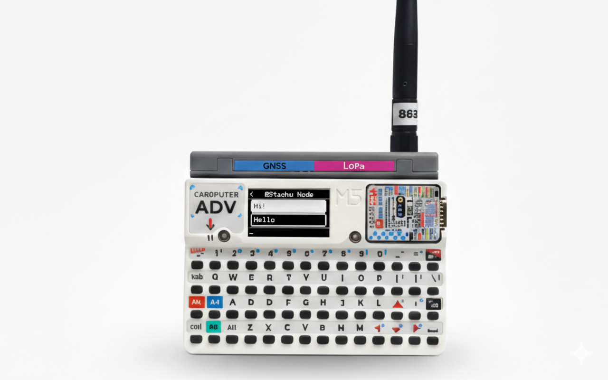

# 🔥 MeshCore-Cardputer-ADV 🔥

[](https://buymeacoffee.com/Stachu)

## 🌐 Quick Flash via Web Flasher
**[Flash Firmware Online →](https://meshcorecardputeradv.vercel.app/)**

No installation needed! Flash directly from your browser.

---

Enhanced TFT user interface for MeshCore mesh networking firmware, optimized for M5Stack Cardputer-Adv with Cap LoRa868.



## 📦 Installation Options

### Option 1: Web Flasher (Recommended)
Visit **[https://meshcorecardputeradv.vercel.app/](https://meshcorecardputeradv.vercel.app/)** and flash directly from your browser - no software installation required!

### Option 2: M5Burner
Search in M5Burner for:
- `MeshCore-Cardputer-ADV M5Stack Cap LoRa-1262 version!!!!` - **Plug-and-play**

### Option 3: Pre-compiled Binary
Download `firmware_Cap_LoRa-1262.bin` from [Releases](https://github.com/Stachugit/MeshCore-Cardputer-ADV/releases) and flash using esptool.py or ESP Flash Download Tool.

## 🔧 Hardware Requirements

### M5Stack Cap LoRa-1262 (Required)
Simply attach the Cap LoRa-1262 to your Cardputer-Adv - no wiring needed!
- **Module**: RA-01SH (SX1262)
- **Frequency**: 863-870 MHz
- **Documentation**: [Cap LoRa-1262](https://docs.m5stack.com/en/cap/Cap_LoRa-1262)

## ✨ Features

### Chat Interface
- **Chat bubbles** with sender names
- **150-character limit** with real-time counter
- **Notification popups** for new messages
- **Message scrolling** with FN+UP/DOWN
- **18 color themes** with brightness control
- **Real-time search** in contacts and channels

### Keyboard Controls
- **🟠 ↑** - Up
- **🟠 ↓** - Down
- **🟠 ←** - Contacts
- **🟠 →** - Channels
- **Enter** - Send/Select
- **Backspace** - Delete | **Hold Backspace** - Clear all
- **🟠 FN+ESC** - Go back
- **Opt** - Go back
- **🟠 FN+↑** / **🟠 FN+↓** - Scroll messages (in writing mode)
- **🟠 FN+DEL** - Delete contacts/channels

### Settings Menu (☰)

Access the settings menu via the **☰** icon in the top-left corner. All settings persist across restarts.

#### 📱 Public Info
- **Change Name** - Modify device name
- **Share Key** - Display QR code with public key for easy pairing
- **Share Position** - Enable/disable position sharing in advertisements

#### 📡 Radio Setup
- **GPS On/Off** - Enable or disable GPS (position checked every 3 minutes)
- **Choose Preset** - Select from predefined radio configurations
- **Manual Setup** - Configure individual parameters:
  - Frequency
  - Bandwidth
  - Spreading Factor (SF)
  - Coding Rate (CR)
  - TX Power

#### 🎨 Theme
- **Brightness Control** - Adjust screen brightness
- **Color Schemes** - Choose from 18 available themes

#### ⚙️ Other
- **Sleep Timeout** - Screen auto-sleep options: 10s, 30s, 1m, 2m, 5m, Never
- **Factory Reset** - Restore device to factory settings (generates new key)
- **Spark the Project** - Support development via QR code (links to Buy Me a Coffee)

#### 📊 Device Info
View real-time device information:
- Device name
- Battery status
- GPS coordinates
- Radio frequency
- Spreading Factor (SF)
- TX Power
- System uptime

## 🚀 Initial Setup

**Important**: First-time configuration requires the MeshCore mobile app:

1. Flash firmware to Cardputer-Adv (via web flasher or M5Burner)
2. Download MeshCore app on your smartphone
3. Connect via Bluetooth using the pairing code displayed in the top-right corner of the screen
4. Configure node name, region, network keys, and channels

## 🆕 What's New in This Version

### Major Features
- **Delete contacts and channels** from device using FN+DEL
- **Comprehensive settings menu** organized into tabs: Public Info, Radio Setup, Theme, Other, and Device Info
- **GPS integration** with 3-minute position update intervals
- **Manual radio configuration** for advanced users
- **QR code sharing** for easy device pairing
- **Position sharing toggle** for privacy control
- **Multiple sleep timeout options** for battery optimization
- **Factory reset option** for easy device reconfiguration

### Improvements
- Enhanced Cap LoRa-1262 compatibility and stability
- UI refinements for better usability
- Power consumption optimizations for extended battery life
- Improved Bluetooth pairing experience

## 🛠️ Building from Source

```bash
git clone https://github.com/Stachugit/MeshCore-Cardputer-ADV.git
cd MeshCore-Cardputer-ADV

# For Cap LoRa-1262:
pio run -e M5stack_cardputer_cap_lora1262_companion --target upload
```

## 🙏 Credits

Based on [MeshCore](https://github.com/meshcore-dev/MeshCore) mesh networking firmware. This project adds custom TFT UI, chat bubbles, comprehensive settings system, theme customization, and enhanced keyboard navigation.

Cap LoRa-1262 compatibility fixes based on work by [sosprz](https://github.com/sosprz/meshcore-cardputer-adv).

## 📜 License

Same license as original MeshCore firmware. See [license.txt](license.txt).

## 🤝 Contributing

Contributions welcome! Report bugs, suggest features, submit pull requests, or improve documentation.

## 🔗 Links

- **Web Flasher**: https://meshcorecardputeradv.vercel.app/
- **Original MeshCore**: https://github.com/meshcore-dev/MeshCore
- **M5Stack Cardputer-ADV**: https://shop.m5stack.com/products/m5stack-cardputer-adv-version-esp32-s3
- **Cap LoRa-1262**: https://docs.m5stack.com/en/cap/Cap_LoRa868
- **Support Development**: https://buymeacoffee.com/Stachu

## ⚠️ Disclaimer

Independent UI modification of MeshCore. For core networking questions, refer to the original project.

---

**Version**: 1.1.0 | **Last Updated**: January 27, 2026
